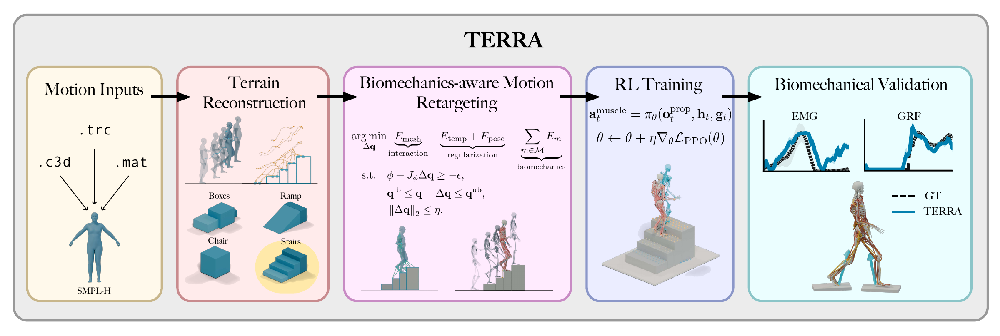

# TERRA

**Terrain-aware motion retargeting and muscle-actuated control with MyoFullBody.** TERRA
takes human motion recordings, estimates supporting terrain, retargets motion to a
musculoskeletal model, and uses the resulting trajectories to train terrain-conditioned
PPO policies.

The repository contains the method implementation, command-line tools, configuration
presets, and end-to-end workflow guides. Motion datasets and SMPL-H body models have
separate licenses and must be obtained from their original providers.

[Project website](https://cnai.epfl.ch/terra/) · [Installation](docs/installation.md) · [Data and model setup](docs/data.md) · [Citation](#citation)



## Method at a glance

| Component | Input → output | Start here |
|---|---|---|
| **1. Motion file handling and transformation** | AMASS SMPL-H or C3D/TRC/MAT markers → parsed or fitted body motion with explicit units and frame rate | [Motion files](docs/motion-files.md) |
| **2. Terrain reconstruction** | Motion landmarks and contact evidence → terrain geometry and a validation report | [Terrain reconstruction](docs/terrain-reconstruction.md) |
| **3. Motion retargeting** | Motion plus terrain → MyoFullBody trajectory, analysis, and terrain sidecar | [Motion retargeting](docs/motion-retargeting.md) |
| **4. Policy training** | Verified trajectory cohort → terrain-conditioned PPO checkpoint | [Policy training](docs/policy-training.md) |

`terra retarget` runs components 2 and 3 together for one motion. The separate
reconstruction and training commands serve larger, explicitly selected cohorts.
Watch short examples of [terrain reconstruction](docs/assets/videos/reconstruction.mp4),
[stair retargeting comparison](docs/assets/videos/retargeting-stairs.mp4), and a
[ramp policy rollout](docs/assets/videos/policy/s00-steep-ascent-ekut-slp201.mp4).

## Requirements and installation

Use **Linux**, **Python 3.11**, [Git](https://git-scm.com/), and
[uv](https://docs.astral.sh/uv/). Run commands from the repository root. The lockfile
pins TERRA's Python dependencies and the required MuscleMimic fork. On Linux x86-64, the
locked PyTorch wheel is a CUDA 12.6 build even when fitting on CPU, so allow for a
substantial first download. A GPU is required for PPO training and policy evaluation; it
is not required for motion loading or artifact checks.

```bash
uv sync --locked --python 3.11
source .venv/bin/activate
terra --version
terra --help
```

Install the extras needed for your work; uv updates the same `.venv`:

```bash
# C3D marker files and comparison retargeters
uv sync --locked --python 3.11 --extra c3d --extra baselines

# JAX CUDA 12 support for GPU training and evaluation
uv sync --locked --python 3.11 --extra cuda

# Tests and linting
uv sync --locked --python 3.11 --extra dev
```

Pass all needed `--extra` flags together in your final `uv sync` command. See the
[installation notes](docs/installation.md) for environment checks and setup errors.

## First result: retarget one SMPL-H motion

This path needs **one AMASS-compatible SMPL-H `.npz` motion** and the licensed **neutral
SMPL-H model**. [Data setup](docs/data.md) explains where to obtain them and how to
check the file layout. AMASS motions need no marker conversion. Choose a motion that you
downloaded, then set its absolute path:

```bash
export TERRA_DATA_ROOT="$HOME/terra-data"
export TERRA_MODEL_ROOT="$HOME/terra-models/smplh"
export TERRA_ARTIFACT_ROOT="$HOME/terra-results"
export MOTION_FILE="/absolute/path/to/AMASS/Collection/Subject/motion_poses.npz"

test -f "$MOTION_FILE"
test -f "$TERRA_MODEL_ROOT/SMPLH_NEUTRAL.pkl"
mkdir -p "$TERRA_ARTIFACT_ROOT"

terra retarget "$MOTION_FILE" \
  --smpl-model-path "$TERRA_MODEL_ROOT" \
  --output-root "$TERRA_ARTIFACT_ROOT/quickstart" \
  --name FirstRun/motion
```

The command prints JSON paths for the trajectory (`.npz`), analysis (`_analysis.npz`),
and, when present, reconstructed terrain (`_terrain.json`). The first run also fits and
caches the MyoFullBody body shape, so it can take longer than later runs. A flat motion
may have no terrain sidecar. Validate the published artifacts with the same read-side
API used by downstream workflows:

```bash
python - <<'PY'
import os
from pathlib import Path
from terra import validate_retarget_artifacts

root = Path(os.environ["TERRA_ARTIFACT_ROOT"]) / "quickstart"
result = validate_retarget_artifacts(root, "FirstRun/motion")
print(f"{result.num_frames} frames at {result.frequency:g} Hz")
print(f"non-flat terrain: {result.nonflat_terrain}")
print(result.trajectory_path)
PY
```

The default `terrain="auto"` estimates support geometry from the motion. To use a known
terrain, pass its metadata JSON path with `--terrain`; to place the result on flat
ground, pass `--terrain none`. See [Motion retargeting](docs/motion-retargeting.md) for
the Python API, marker inputs, configuration choices, artifact layout, and video review.

## Explore the four components

1. [Motion files](docs/motion-files.md) covers input formats, archive checks, and
   dataset-specific conversion.
2. [Terrain reconstruction](docs/terrain-reconstruction.md) explains its evidence,
   standalone cohort command, output records, and validation.
3. [Motion retargeting](docs/motion-retargeting.md) covers the CLI, Python API,
   configuration, and paired output artifacts.
4. [Policy training](docs/policy-training.md) covers CUDA preflight, verified cohort
   materialization, a one-update smoke run, and PPO launch.

## Repository map

| Location | Contents |
|---|---|
| `src/terra/datasets/`, `src/terra/smplh.py`, `src/terra/trc.py`, `src/terra/mat.py` | Source conversion and motion loading |
| `src/terra/terrain/`, `src/terra/reconstruction.py` | Contact inference, terrain fitting, and validation |
| `src/terra/api.py`, `src/terra/artifacts.py`, `src/terra/baselines/` | Public retargeting API, published artifacts, and comparison methods |
| `src/terra/rl/`, `src/terra/training.py` | Tracking environment, PPO configuration, and launcher |
| `scripts/terra/train_smoke.py`, `docs/` | PPO startup check and end-to-end guides |

For development, run `uv sync --locked --python 3.11 --extra dev`, then
`uv run --locked --extra dev pytest -q` and `uv build`.
TERRA is licensed under [Apache-2.0](LICENSE). Third-party code, datasets, body models,
and checkpoints retain their respective licenses.

## Citation

Cite the preprint:

```bibtex
@misc{simos2026terra,
  title  = {{TERRA}: Terrain-Aware Reconstruction, Retargeting and Control for Musculoskeletal Locomotion},
  author = {Simos, Merkourios and Li, Chengkun and Ziliotto, Bianca and Mathis, Alexander},
  year   = {2026},
  eprint = {2609.38653},
  archivePrefix = {arXiv},
  primaryClass = {cs.RO},
  url    = {https://arxiv.org/abs/2609.38653}
}
```
