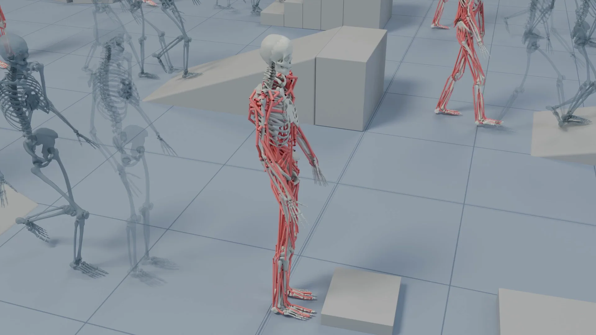

# TERRA

**Terrain-Aware Reconstruction, Retargeting and Control for Musculoskeletal Locomotion**

TERRA recovers support geometry from human motion, retargets motion to a musculoskeletal body, and trains a muscle-actuated policy to track movements across ramps, stairs, seats, platforms, beams, and other terrain.

[Explore the project website](https://cnai.epfl.ch/terra/) for the method overview and videos of terrain reconstruction, retargeting comparisons, and policy rollouts.

The preprint and research code will be added here at release. The site is available now as a preview of the project.

Merkourios Simos · Chengkun Li · Bianca Ziliotto · Alexander Mathis

EPFL
